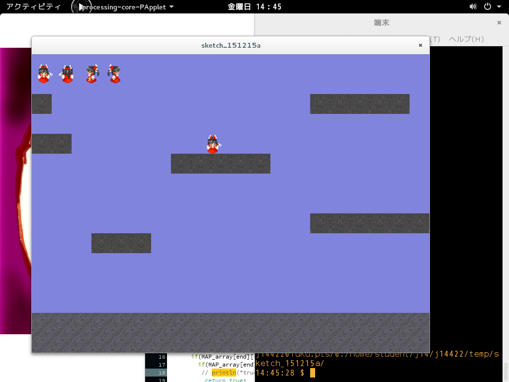

#ゲームについて
##ゲーム説明
>このゲームはフィールド内を自由に動き回ることの出来るゲームである．
  
##マニュアル
>ゲームを開始して，表1.1に示すキーボード入力を行う．

 
表1.1 キーボード入力による行動

| INPUT |   ACTION  |
|:---|:---|
|A|move left| 
|D|move right|
|SPACE|jamp|

##動作画面

##工夫した点
>マップの読み込みをJSONファイルから読み込むことで，ステージの変更を容易にした． 
>画像の分割読み込み． 
>透過した画像を使用したが，画像を分割することにより，透過されなくなってしまうことが判明した． 

##プログラムリスト
>プログラムリストについては[以下のリンク](https://github.com/waribashi624/2dprocessing/tree/issue1/sketch_151215a)を参照されたし．

